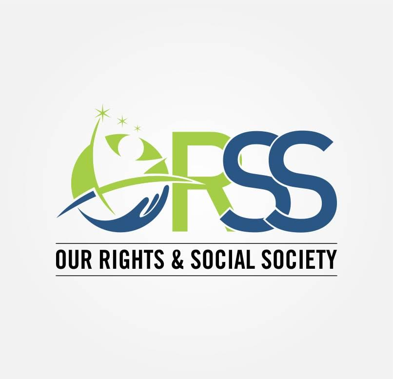

# ORSS Organisation Website

 <!-- Add your organization's logo here -->

## About

The ORSS Organisation Website is a web project developed using HTML, CSS, JavaScript, and Bootstrap. It serves as the online presence for Our Rights & Social Society (ORSS), a voluntary development organization established in 2017. ORSS is registered under the society registration Act 1860 and operates as a national NGO with a focus on serving marginalized and vulnerable populations in India, particularly in the Delhi JJ cluster area.

The website's mission is to create awareness about ORSS's initiatives and highlight their commitment to community development, attitudinal change, socio-economic transformation, and the promotion of the right to education, good health, information, and human rights.Here is our website : http://www.orss.org.in

## Features

- **About Us:** Learn more about ORSS, its history, mission, and objectives.
- **Programs:** Explore the various social services and initiatives undertaken by ORSS.
- **Get Involved:** Find out how you can contribute to ORSS's mission and become a part of the change.
- **Contact:** Get in touch with ORSS for inquiries or collaboration opportunities.

## Contact

  For any questions or inquiries, please contact ORSS at:

    Email: contact@orss.org
    Website: www.orss.org.in

  © 2022 ORSS Organisation
